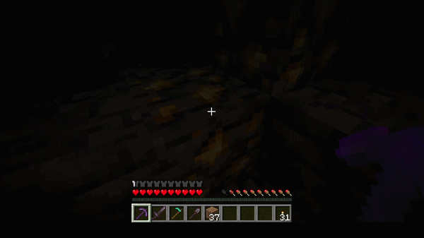

## Introduction

Enchantments EX is a Minecraft Fabric mod that aims to "enchant" the enchantment experience by adding a new tier of enchantments to all Vanilla enchantments (excluding Curses and Silk Touch).

Each EX enchantment will add additional buffs that complement your Minecraft experience and make you stronger.

## Enchantment Function Documentation

| Enchantment              | New Function                                                                                                                                                                               |
|--------------------------|--------------------------------------------------------------------------------------------------------------------------------------------------------------------------------------------|
| Aqua Affinity EX         | Immune to Mining Fatigue.                                                                                                                                                                  |
| Bane of Arthropods EX    | Immune to Poison. Cobwebs break on contact while holding weapon.                                                                                                                           |
| Blast Protection EX      | Nearby Creepers gain Slowness according to the enchantment level.                                                                                                                          |
| Breach EX                | Deals extra damage per level to Ravagers, Ender Dragons, Withers, Iron Golems, and Wardens.                                                                                                |
| Channeling EX            | No longer needs active thunderstorms to summon lightning.                                                                                                                                  |
| Density EX               | Smash attacks inflict Weakness, Slowness, and Nausea to its target, and Resistance to the attacker.                                                                                        |
| Depth Strider EX         | Attack speed is increased per level underwater. Nearby dolphins gain Strength, Resistance, and Speed.                                                                                      |
| Efficiency EX            | Extra damage against shulkers. Increased block interaction range.                                                                                                                          |
| Feather Falling EX       | Safe fall distance is increased by 7 blocks.                                                                                                                                               |
| Fire Aspect EX           | Deals extra damage per level to all targets already on fire or targets that are naturally immune to fire.                                                                                  |
| Fire Protection EX       | Extra level-based scaled damage protection when in the Nether.                                                                                                                             |
| Flame EX                 | Deals extra damage per level to all targets already on fire or targets that are naturally immune to fire.                                                                                  |
| Fortune EX               | Overworld ores will additionally drop their block version when mined. Nether Gold Ore drops gold ingots, and Ancient Debris drops Netherite Ingots.                                        |
| Frost Walker EX          | Reduces freezing damage and increases speed when walking on Ice per level.                                                                                                                 |
| Impaling EX              | Damage bonus now applies on Bedrock conditions (when the weather is raining or thundering, or when the target is in water). Also, adds air supply per hit.                                 |
| Infinity EX              | Now works on spectral and tipped arrows as well as firework rockets when applied to Crossbows via command.                                                                                 |
| Knockback EX             | Knocks enemies upward. Higher levels will create higher upward velocity per hit.                                                                                                           |
| Looting EX               | Multiplies mob experience gain depending on level.                                                                                                                                         |
| Loyalty EX               | When the trident hits a block, teleports any item within 3 blocks of where the trident landed to the player who threw it.                                                                  |
| Luck of the Sea EX       | Obtaining treasure from fishing will include additional loot, including rare, formerly non-renewable items.                                                                                |
| Lunge EX                 | Not implemented in 1.21.1                                                                                                                                                                  |
| Lure EX                  | Any item within 2 blocks of the fishing bobber is instantly retrieved by the player, and the fishing rod automatically returns when it catches fish.                                       |
| Mending EX               | The durability repair effectiveness is doubled.                                                                                                                                            |
| Multishot EX             | Maximum enchantment level is increased to 5, shoots 4 arrows per level, and halves the projectile spread per level. Also, can enchant Bows and is compatible with Piercing or Piercing EX. |
| Piercing EX              | Compatible with Multishot and Multishot EX, can be applied to bows, and does extra damage when using firework rockets or targeting Skeletons.                                              |
| Power EX                 | Has a chance scaling by level of applying Wither II to targets.                                                                                                                            |
| Projectile Protection EX | Reduces knockback, and its projectile protection now also extends to the Warden's Sonic Boom.                                                                                              |
| Protection EX            | Attackers have a scaled chance of being inflicted with Weakness.                                                                                                                           |
| Punch EX                 | Knocks enemies upward. Higher levels will create higher upward velocity per hit.                                                                                                           |
| Quick Charge EX          | Maximum enchantment level raised to 5. Also, lights arrows on fire upon firing.                                                                                                            |
| Respiration EX           | Any player with Dolphin's Grace, Water Breathing, or Conduit Power gains Regeneration per level.                                                                                           |
| Riptide EX               | Can be used outside of water or rain.                                                                                                                                                      |
| Sharpness EX             | Has a chance scaling by level of applying Wither II to targets.                                                                                                                            |
| Smite EX                 | Applies Weakness V to all undead mobs and Wardens, and Weakness I to all other targets.                                                                                                    |
| Soul Speed EX            | Does not drain durability when walking or running on Soul Sand or Soul Soil.                                                                                                               |
| Sweeping Edge EX         | Extra damage against all flying mobs.                                                                                                                                                      |
| Swift Sneak EX           | Raised the maximum enchantment level to 5 and increases step size by 0.5 blocks.                                                                                                           |
| Thorns EX                | Increases the chance of activating per level, decreases less durability per use, and deals additional damage per level.                                                                    |
| Unbreaking EX            | Attacking or being attacked will have a scaled chance of giving experience.                                                                                                                |
| Wind Burst EX            | Performing an appropriate smash attack will now also grant Resistance and Strength. Additionally, reduces fall damage when held in hand.                                                   |

## Using this mod

Accessing the EX enchantments revolves around a Stamping Table, which consumes Molten Ink to upgrade 1 enchantment from an Enchanted Book.

TODO add images

## Setup

For setup instructions, please see the [Fabric Documentation page](https://docs.fabricmc.net/develop/getting-started/creating-a-project#setting-up) related to the IDE that you are using.

## License

This template is available under the CC0 license. Feel free to learn from it and incorporate it in your own projects.
